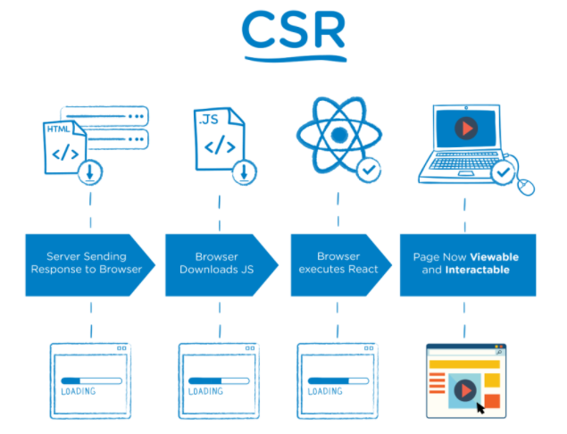
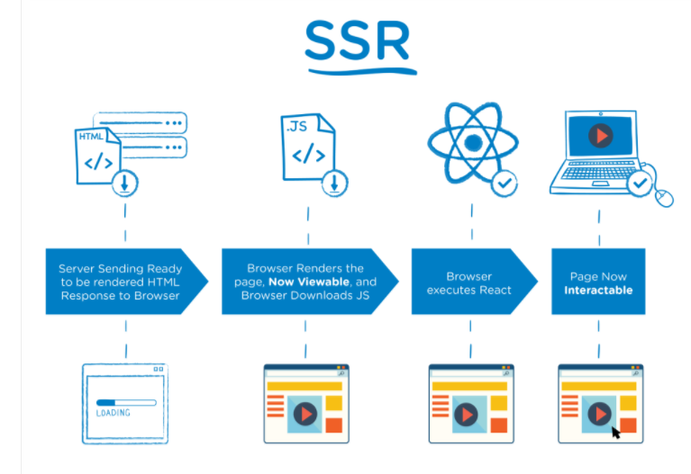

# Areas

## Tech stack

1. [NextJS](https://nextjs.org/)
   a) redux, @reduxjs/toolkit
2. [tailwindcss](https://tailwindcss.com/)
   a) Heroicons
3. [Firebase](https://firebase.google.com/)
   a) db

## Header

1. es el componente común a todas las rutas del front end

## Páginas/ Rutas del Front End

1. Home (index.js)

- Se comunica con la API - [Fake Store API](https://fakestoreapi.com/)
- Obtiene los datos con SSR, y los pasa al componente como props.
  Con SSR, el HTML se renderiza en el lado del servidor. En la primera petición, se devuelve un index con contenido ya procesado, y luego se
  va completando. Es muy útil para mantener a los usuarios impacientes en nuestra web, aunque en realidada, la web no esté cargada del todo.
- También és útil para el SEO, y asegurarnos de que nuestra aplicación es indexada.

- Con CSR, se modifica el DOM en el lado del cliente, lo cuál es más lento, aunque en el caso de REACT, como tiene un DOM virtual, la diferencia
  no es tanta
  ejemplos

2. Checkout (checkout.js)

- Consume el el array items procedente de redux
- Itera el array items y renderiza el componente <CheckoutProduct/> pasando items como props
- Al clickar el botón "Proceed to Checkout", ejecutamos la función "createCheckoutSession"
  a) Cargamos stripe
  b) hacemos un post al endpoint "/api/checkout-session"
  c) el body del post consiste en los items, y el email
  d) redireccionamos al usuario a la página de checkout de Stripe

  3. Orders (orders.js)

  a) Obtenemos los orders de db (firebase)
  b) Obtenemos las credenciales del usuario, ya que si no tenemos al usuario dentro, no podemos procesar la ordn
  c) Transformamos el objeto en un objeto que Stripe pueda comprender - el propio formato que exige Stripe para aceptar las "orders"
  d) Pasamos orders como props al componente "orders", que a su vez, se las pasa a <Order/> para que las pueda renderizar.

4. Success (success.js)

## Rutas del Back End

1. api/[...nextauth].js

- Es la configuración del modulo next-auth
- Esta configuración se pasa a \_app.js como un Provider
- Podemos configurar el login con Google o con cualquier otro proveedor - Github, Facebook, etc ...

2. api/create-checkout-session

- el backend recibe la info del front-end (items e email)
- transformamos los datos a un objeto, en un formato que Stripe pueda aceptar
- creamos una página de sesión
  a) añadimos un método de pago
  b) le asignamos a line_items el objeto transformado
  c) si tenemos éxito y se procesa el pago, redireccionamos al usuario a la ruta de success
  d) si el proceso falla, redireccionamos de nuevo a la ruta checkout
  e) el mail conecta stripe con firebase

3. api/webhook

- también conocido como API inversa.
- el hook nos conecta con el API de Stripe, y cuando stripe ya ha resuelto el pago nos lo notifica
- esto es una gran alternativa a que tengamos que estar haciendo nosotros "requests" continuos para ver si el proceso ha acabado. Y la mayoría de estos requests se perderán, ya que solo servirá el último.
